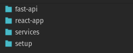

# Services Repository

## Description
This repository contains a multi-container Docker application that includes MySQL, MongoDB, Redis, PHPMyAdmin, a FastAPI backend, and a React frontend. It's designed to provide a comprehensive development environment for web applications.

## Components
- **MySQL**: A relational database management system.
- **MongoDB**: A NoSQL database.
- **Redis**: An in-memory data structure store, used as a database, cache, and message broker.
- **PHPMyAdmin**: A free and open-source administration tool for MySQL and MariaDB.
- **FastAPI Application**: A modern, fast (high-performance) web framework for building APIs with Python.
- **React Application**: A JavaScript library for building user interfaces.

## Setup and Installation

### Prerequisites
- Docker and Docker Compose installed on your machine.


### Repository setup
Clone the repositories from [GitHub](https://github.com/dhbw-loerrach-wds22a)
1. setup
2. fast-api
3. react-app
4. services

Layout of the repositories:


### Installation Steps
1. Clone the repository to your local machine.
2. Navigate to the directory containing `docker-compose.yml`.
3. Run the following command to build the projects. keep in mind that 4 repositories have to be in place. 
   ```bash
   docker-compose build

4. Run the following command to start all services:
   ```bash
   docker-compose up -d
5. To stop the services, use:
    ```bash
    docker-compose down
   
## Accessing the Services

- **MySQL** is accessible on port `3306`. Default root password is `mypassword`.
- **MongoDB** is accessible on port `27017`.
- **Redis** is accessible on port `6379`.
- **PHPMyAdmin** can be accessed at [http://localhost:8080](http://localhost:8080).
- **FastAPI Application** is accessible at [http://localhost:8081](http://localhost:8081).
- **React Application** is accessible at [http://localhost](http://localhost).

## Data Persistence

- MySQL data is persisted in `./data/mysql-data`.
- MongoDB data is persisted in `./data/mongodb-data`.

## Usage

- Use PHPMyAdmin to manage your MySQL databases.
- Access the FastAPI application for backend operations.
- The React application will serve as the frontend interface.

## Note

- Ensure that the ports specified in `docker-compose.yml` are free or change them as needed.
- For the React application, adjust `REACT_APP_API_HOST` in the Dockerfile to match your API host configuration.

## License

[MIT](LICENSE)
